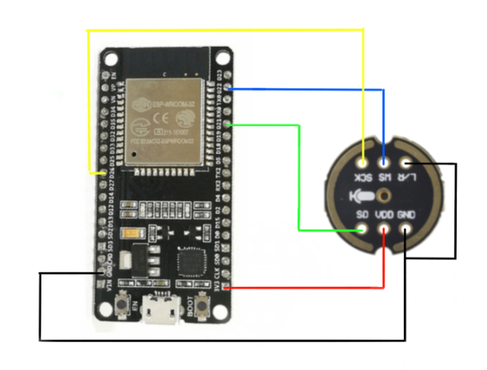

# DP Adam Zverbik

## HW used

__Microcontroller board__:

_ESP32 DEVKIT V1_

https://dratek.cz/arduino/1581-esp-32s-esp32-esp8266-development-board-2.4ghz-dual-mode-wifi-bluetooth-antenna-module.html

__Microphone__:

_INMP441_

https://www.laskakit.cz/inmp441-modul-i2s-mikrofonu/

## Wiring

|INMP PIN   | ESP32 PIN
|-----------|-----------
|WS         | D22
|SCK        | D26
|SD         | D21
|VDD        | 3V3
|GND        | GND
|L/R        | -

